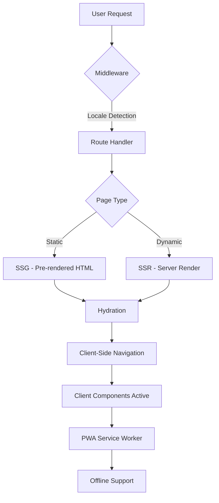

# Design Document: Next.js Migration

## Overview

This design outlines the technical architecture for migrating a React/Vite portfolio site to Next.js 14+ with the App Router. The migration preserves all existing features while introducing server-side rendering (SSR) for improved SEO, maintaining Progressive Web App (PWA) capabilities, internationalization (i18n), theme management, and analytics integration.

The current application is a single-page application (SPA) built with React 18, Vite, React Router, and various supporting libraries. The migration to Next.js will transform this into a hybrid application leveraging both Server Components and Client Components, with SSR for initial page loads and client-side navigation for subsequent interactions.

Key architectural changes include:
- Replacing React Router with Next.js App Router
- Converting client-only rendering to SSR with hydration
- Implementing Next.js middleware for i18n routing
- Migrating Vite PWA plugin to next-pwa
- Adapting theme management for SSR compatibility
- Converting dynamic imports to Next.js dynamic() with SSR support

## Architecture

### Application Structure

The Next.js application will follow the App Router structure:

```
nextjs-portfolio/
├── app/
│   ├── [locale]/                    # Internationalized routes
│   │   ├── layout.tsx               # Root layout with providers
│   │   ├── page.tsx                 # Home page
│   │   ├── contact/
│   │   │   └── page.tsx
│   │   ├── projects/
│   │   │   ├── page.tsx
│   │   │   └── [projectId]/
│   │   │       └── page.tsx
│   │   └── publication/
│   │       └── [publicationId]/
│   │           └── page.tsx
│   ├── api/                         # API routes (if needed)
│   ├── not-found.tsx                # 404 page
│   └── error.tsx                    # Error boundary
├── components/                      # Existing components (migrated)
│   ├── client/                      # Client Components
│   └── server/                      # Server Components
├── lib/
│   ├── i18n/                        # i18n configuration
│   │   ├── settings.ts
│   │   ├── server.ts                # Server-side i18n
│   │   └── client.ts                # Client-side i18n
│   └── utils.ts
├── public/                          # Static assets (unchanged)
├── locales/                         # Translation files
│   ├── en.json
│   ├── ja.json
│   └── th.json
├── middleware.ts                    # i18n routing middleware
├── next.config.js                   # Next.js configuration
└── package.json
```

### Rendering Strategy

The application will use a hybrid rendering approach:

1. **Server Components (Default)**:
   - Layout components (Navbar, Footer)
   - Static content sections (Hero, About)
   - SEO metadata generation
   - Initial page structure

2. **Client Components**:
   - Interactive UI elements (ThemeToggle, LanguageSwitcher)
   - Components with browser APIs (OfflineIndicator, NetworkBackground)
   - Components with animations (PageTransition, ScrollProgress)
   - Context providers (LiteModeProvider)
   - Form components with state management

3. **Static Generation (SSG)**:
   - Home page
   - Project detail pages (pre-rendered at build time)
   - Publication detail pages (pre-rendered at build time)

4. **Server-Side Rendering (SSR)**:
   - Contact page (for dynamic content if needed)
   - 404 and error pages

### Data Flow



## Components and Interfaces

### Core Components Migration

#### Server Components

These components will be Server Components by default:

1. **Layout Components**:
   - `RootLayout`: Wraps entire application with HTML structure
   - `LocaleLayout`: Handles locale-specific layouts
   - `Footer`: Static footer content

2. **SEO Components**:
   - `Metadata`: Next.js metadata API for SEO tags
   - `StructuredData`: JSON-LD structured data generation

#### Client Components

These components require 'use client' directive:

1. **Interactive Components**:
   - `Navbar`: Navigation with active state
   - `ThemeToggle`: Theme switching with localStorage
   - `LanguageSwitcher`: Language selection with state
   - `SearchBar`: Search functionality with state
   - `ContactSection`: Form with validation and submission

2. **Browser API Components**:
   - `OfflineIndicator`: Uses navigator.onLine
   - `NetworkBackground`: Canvas rendering
   - `PullToRefresh`: Touch event handling
   - `ScrollProgress`: Scroll position tracking
   - `ScrollToTop`: Scroll behavior

3. **Animation Components**:
   - `PageTransition`: Framer Motion animations
   - All components using Framer Motion

4. **Context Providers**:
   - `LiteModeProvider`: Client-side context
   - `ThemeProvider`: next-themes provider

### Component Conversion Patterns

#### Pattern 1: React Router Link → Next.js Link

```javascript
// Before (React Router)
import { Link } from 'react-router-dom';
<Link to="/projects">Projects</Link>

// After (Next.js)
import Link from 'next/link';
<Link href="/projects">Projects</Link>
```

#### Pattern 2: Lazy Loading → Next.js Dynamic

```javascript
// Before (React lazy)
const ExperienceSection = lazy(() => import("../components/ExperienceSection"));

// After (Next.js dynamic)
const ExperienceSection = dynamic(() => import("@/components/ExperienceSection"), {
  loading: () => <ExperienceSkeleton />,
  ssr: true
});
```

#### Pattern 3: Client-Side Only Components

```javascript
// Before (implicit client-side)
export default function NetworkBackground() {
  // Uses canvas API
}

// After (explicit client directive)
'use client';
export default function NetworkBackground() {
  // Uses canvas API
}
```

### Internationalization Architecture

#### Server-Side i18n

```typescript
// lib/i18n/server.ts
import { createInstance } from 'i18next';
import { initReactI18next } from 'react-i18next/initReactI18next';

export async function getServerTranslations(locale: string) {
  const i18nInstance = createInstance();
  await i18nInstance
    .use(initReactI18next)
    .init({
      lng: locale,
      resources: {
        [locale]: {
          translation: await import(`@/locales/${locale}.json`)
        }
      },
      fallbackLng: 'en'
    });
  return i18nInstance;
}
```

#### Client-Side i18n

```typescript
// lib/i18n/client.ts
'use client';
import i18next from 'i18next';
import { initReactI18next } from 'react-i18next';
import LanguageDetector from 'i18next-browser-languagedetector';

// Initialize with dynamic loading
export function initClientI18n(locale: string, translations: any) {
  i18next
    .use(LanguageDetector)
    .use(initReactI18next)
    .init({
      lng: locale,
      resources: {
        [locale]: { translation: translations }
      },
      fallbackLng: 'en'
    });
}
```

#### Middleware for Locale Routing

```typescript
// middleware.ts
import { NextRequest, NextResponse } from 'next/server';

const locales = ['en', 'ja', 'th'];
const defaultLocale = 'en';

export function middleware(request: NextRequest) {
  const pathname = request.nextUrl.pathname;
  
  // Check if pathname already has a locale
  const pathnameHasLocale = locales.some(
    (locale) => pathname.startsWith(`/${locale}/`) || pathname === `/${locale}`
  );

  if (pathnameHasLocale) return;

  // Detect locale from headers or cookies
  const locale = getLocale(request) || defaultLocale;
  
  // Redirect to localized path
  return NextResponse.redirect(
    new URL(`/${locale}${pathname}`, request.url)
  );
}

export const config = {
  matcher: ['/((?!api|_next|_vercel|.*\\..*).*)']
};
```

### Theme Management Architecture

#### Server-Side Theme Detection

```typescript
// app/[locale]/layout.tsx
import { cookies } from 'next/headers';

export default async function LocaleLayout({ children, params }) {
  const cookieStore = await cookies();
  const theme = cookieStore.get('chaipat-theme')?.value || 'system';
  
  return (
    <html lang={params.locale} className={theme} suppressHydrationWarning>
      <body>
        <ThemeProvider
          attribute="class"
          defaultTheme={theme}
          enableSystem
          storageKey="chaipat-theme"
        >
          {children}
        </ThemeProvider>
      </body>
    </html>
  );
}
```

#### Client-Side Theme Switching

The existing `next-themes` library will be used with minimal changes. The ThemeProvider will be wrapped in a Client Component to handle browser-side theme switching.

### PWA Architecture

#### Service Worker Strategy

Next.js PWA will use `next-pwa` package with Workbox:

```javascript
// next.config.js
const withPWA = require('next-pwa')({
  dest: 'public',
  register: true,
  skipWaiting: true,
  disable: process.env.NODE_ENV === 'development',
  runtimeCaching: [
    {
      urlPattern: /^https:\/\/fonts\.googleapis\.com\/.*/i,
      handler: 'CacheFirst',
      options: {
        cacheName: 'google-fonts-cache',
        expiration: {
          maxEntries: 10,
          maxAgeSeconds: 365 * 24 * 60 * 60
        }
      }
    },
    {
      urlPattern: /^https:\/\/fonts\.gstatic\.com\/.*/i,
      handler: 'CacheFirst',
      options: {
        cacheName: 'gstatic-fonts-cache',
        expiration: {
          maxEntries: 10,
          maxAgeSeconds: 365 * 24 * 60 * 60
        }
      }
    },
    {
      urlPattern: /\.(?:jpg|jpeg|png|gif|webp|svg|ico)$/i,
      handler: 'CacheFirst',
      options: {
        cacheName: 'image-cache',
        expiration: {
          maxEntries: 60,
          maxAgeSeconds: 30 * 24 * 60 * 60
        }
      }
    }
  ]
});

module.exports = withPWA({
  // Next.js config
});
```

#### Offline Support

The existing `OfflineIndicator` component will continue to work as a Client Component. The PWA service worker will handle offline caching automatically.

### Image Optimization

#### Migration from OptimizedImage to Next.js Image

```javascript
// Before (Custom OptimizedImage)
<OptimizedImage
  src="/profile.jpeg"
  alt="Profile"
  width={400}
  height={400}
/>

// After (Next.js Image)
import Image from 'next/image';
<Image
  src="/profile.jpeg"
  alt="Profile"
  width={400}
  height={400}
  placeholder="blur"
  blurDataURL="data:image/..."
/>
```

Next.js Image component provides:
- Automatic format optimization (WebP, AVIF)
- Responsive image generation
- Lazy loading by default
- Blur-up placeholders
- CDN caching on Vercel

### Routing Architecture

#### Static Routes

- `/[locale]` → Home page (SSG)
- `/[locale]/contact` → Contact page (SSR)
- `/[locale]/projects` → Projects listing (SSG)

#### Dynamic Routes

- `/[locale]/projects/[projectId]` → Project detail (SSG with generateStaticParams)
- `/[locale]/publication/[publicationId]` → Publication detail (SSG with generateStaticParams)

#### Route Generation

```typescript
// app/[locale]/projects/[projectId]/page.tsx
export async function generateStaticParams() {
  // Generate all project IDs at build time
  const projects = await getProjects();
  return projects.map((project) => ({
    projectId: project.id
  }));
}
```

### Analytics Integration

Vercel Analytics and Speed Insights will be integrated in the root layout:

```typescript
// app/[locale]/layout.tsx
import { Analytics } from '@vercel/analytics/react';
import { SpeedInsights } from '@vercel/speed-insights/react';

export default function LocaleLayout({ children }) {
  return (
    <>
      {children}
      <Analytics />
      <SpeedInsights />
    </>
  );
}
```

## Data Models

### Locale Configuration

```typescript
// lib/i18n/settings.ts
export const locales = ['en', 'ja', 'th'] as const;
export type Locale = (typeof locales)[number];

export const defaultLocale: Locale = 'en';

export const localeNames: Record<Locale, string> = {
  en: 'English',
  ja: '日本語',
  th: 'ไทย'
};
```

### Theme Configuration

```typescript
// lib/theme/types.ts
export type Theme = 'light' | 'dark' | 'system';

export interface ThemeConfig {
  attribute: 'class';
  defaultTheme: Theme;
  enableSystem: boolean;
  storageKey: string;
}
```

### PWA Manifest

```typescript
// lib/pwa/manifest.ts
export interface PWAManifest {
  name: string;
  short_name: string;
  description: string;
  start_url: string;
  display: 'standalone' | 'fullscreen' | 'minimal-ui';
  background_color: string;
  theme_color: string;
  icons: Array<{
    src: string;
    sizes: string;
    type: string;
    purpose?: string;
  }>;
}
```

### SEO Metadata

```typescript
// lib/seo/types.ts
import { Metadata } from 'next';

export interface SEOConfig {
  title: string;
  description: string;
  keywords: string[];
  ogImage: string;
  canonicalUrl: string;
  author: string;
}

export function generateMetadata(config: SEOConfig): Metadata {
  return {
    title: config.title,
    description: config.description,
    keywords: config.keywords,
    authors: [{ name: config.author }],
    openGraph: {
      title: config.title,
      description: config.description,
      url: config.canonicalUrl,
      siteName: 'Chaipat Jainan Portfolio',
      images: [{ url: config.ogImage }],
      locale: 'en_US',
      type: 'website'
    },
    twitter: {
      card: 'summary_large_image',
      title: config.title,
      description: config.description,
      images: [config.ogImage],
      creator: '@AppleBoiy'
    },
    alternates: {
      canonical: config.canonicalUrl
    }
  };
}
```

### Project and Publication Data

```typescript
// lib/data/types.ts
export interface Project {
  id: string;
  title: string;
  description: string;
  technologies: string[];
  githubUrl?: string;
  liveUrl?: string;
  imageUrl?: string;
}

export interface Publication {
  id: string;
  title: string;
  authors: string[];
  venue: string;
  year: number;
  abstract: string;
  pdfUrl?: string;
  doi?: string;
}
```

## Correctness Properties


*A property is a characteristic or behavior that should hold true across all valid executions of a system—essentially, a formal statement about what the system should do. Properties serve as the bridge between human-readable specifications and machine-verifiable correctness guarantees.*

### Property Reflection

After analyzing all acceptance criteria, several properties were identified as redundant or overlapping:

- **15.6** (bookmark compatibility) is logically equivalent to **15.1** (URL route preservation) - both ensure existing URLs continue to work
- **1.1** (complete HTML rendering) and **1.2** (SEO metadata generation) can be combined into a single comprehensive property about server-rendered content
- **5.1** and **5.2** (dynamic routes for projects and publications) follow the same pattern and can be generalized
- **10.2** and **14.6** (security headers) overlap - both ensure specific headers are present

The following properties represent the unique, non-redundant validation requirements:

### Property 1: Server-rendered pages contain complete content

*For any* portfolio page route, when requested from the server, the HTML response should contain fully rendered content including text, metadata, and structural elements (not just empty divs and script tags).

**Validates: Requirements 1.1, 1.2**

### Property 2: Language selection persistence round-trip

*For any* supported language selection, setting the language preference should persist to browser storage, and reading from storage should return the same language value.

**Validates: Requirements 2.2**

### Property 3: Browser language detection applies supported locales

*For any* browser language setting that matches a supported locale, the i18n system should initialize with that locale; for unsupported languages, it should fall back to English.

**Validates: Requirements 2.3**

### Property 4: Locale-based routing accessibility

*For any* valid application route and any supported locale, the combination (e.g., /[locale]/route) should be accessible and return appropriate content.

**Validates: Requirements 2.4**

### Property 5: Server-rendered content matches requested locale

*For any* page and any supported locale, the server-rendered HTML should contain text content in the requested language.

**Validates: Requirements 2.5**

### Property 6: Language changes without page reload

*For any* language switch operation, the page content should update without triggering a full page reload (window.location change).

**Validates: Requirements 2.6**

### Property 7: Theme selection persistence round-trip

*For any* theme selection (light, dark, system), setting the theme should persist to browser storage, and reading from storage should return the same theme value.

**Validates: Requirements 3.2**

### Property 8: System theme changes propagate when system mode selected

*For any* system theme change event, if the user has selected "system" theme mode, the site theme should update to match the new system preference.

**Validates: Requirements 3.4**

### Property 9: Server-rendered theme class matches preference

*For any* theme preference stored in cookies, the server-rendered HTML should include the corresponding theme class on the html element.

**Validates: Requirements 3.5**

### Property 10: Offline content serving from cache

*For any* previously visited and cached page, requesting that page while offline should successfully serve the content from cache.

**Validates: Requirements 4.3**

### Property 11: Dynamic route accessibility

*For any* valid project ID or publication ID, the corresponding dynamic route should be accessible and return the appropriate content.

**Validates: Requirements 5.1, 5.2**

### Property 12: Client-side navigation without page reload

*For any* navigation between application routes using Next.js Link, the navigation should occur without a full page reload.

**Validates: Requirements 5.4**

### Property 13: Non-existent routes return 404

*For any* route that does not exist in the application, requesting that route should return a 404 status and display the not-found page.

**Validates: Requirements 5.5**

### Property 14: Scroll position preservation on back navigation

*For any* navigation sequence (page A → page B → back to A), the scroll position on page A should be preserved when navigating back.

**Validates: Requirements 5.6**

### Property 15: Image optimization generates multiple sizes

*For any* image processed through Next.js Image component, the rendered output should include multiple image sizes in the srcset attribute.

**Validates: Requirements 6.1, 6.4**

### Property 16: Modern image format serving based on browser support

*For any* image request with Accept headers indicating WebP or AVIF support, the server should serve the image in the modern format.

**Validates: Requirements 6.2**

### Property 17: Below-fold images use lazy loading

*For any* image that is not in the initial viewport, the rendered HTML should include loading="lazy" attribute.

**Validates: Requirements 6.3**

### Property 18: Blur placeholders present for configured images

*For any* image configured with blur placeholder, the rendered HTML should include the blurDataURL in the placeholder attribute.

**Validates: Requirements 6.5**

### Property 19: Custom hooks function correctly in Next.js environment

*For any* custom hook (useNetworkStatus, useLazyLoad, useHaptic, usePullToRefresh), calling the hook should return expected values and behavior without errors.

**Validates: Requirements 7.5**

### Property 20: Error boundaries catch and isolate component errors

*For any* component error thrown within an error boundary, the error should be caught, isolated to that boundary, and not crash the entire application.

**Validates: Requirements 7.6, 12.2**

### Property 21: Analytics tracking on all navigation types

*For any* navigation event (initial load, client-side navigation, back/forward), an analytics page view event should be tracked.

**Validates: Requirements 8.3**

### Property 22: Lite mode disables animations

*For any* component with animations, when lite mode is enabled, the animations should be disabled or reduced.

**Validates: Requirements 9.7**

### Property 23: Security headers present on all responses

*For any* page or asset request, the response should include security headers (X-Content-Type-Options, X-Frame-Options, CSP).

**Validates: Requirements 10.2, 14.1, 14.6**

### Property 24: Cache headers present on static assets

*For any* static asset request (images, CSS, JavaScript), the response should include appropriate cache-control headers.

**Validates: Requirements 10.3**

### Property 25: Interactive elements have ARIA labels

*For any* interactive element (buttons, links, form inputs), the element should have appropriate ARIA labels or accessible names.

**Validates: Requirements 11.3**

### Property 26: Heading hierarchy is valid

*For any* page, the heading elements should follow proper hierarchy without skipping levels (e.g., h1 → h2 → h3, not h1 → h3).

**Validates: Requirements 11.4**

### Property 27: Keyboard navigation for interactive features

*For any* interactive feature, all functionality should be accessible and operable using only keyboard input.

**Validates: Requirements 11.6**

### Property 28: Route changes announced to screen readers

*For any* route change, an ARIA live region should be updated to announce the navigation to screen readers.

**Validates: Requirements 11.7**

### Property 29: API request retry on failure

*For any* failed API request, the system should retry the request up to 3 times before giving up.

**Validates: Requirements 12.4**

### Property 30: Development mode error logging

*For any* error that occurs in development mode, an error message should be logged to the console.

**Validates: Requirements 12.5**

### Property 31: Lazy-loaded component fallback on failure

*For any* lazy-loaded component that fails to load, a fallback UI should be displayed instead of crashing.

**Validates: Requirements 12.6**

### Property 32: Input sanitization in forms

*For any* user input in contact forms, dangerous content (scripts, HTML) should be sanitized before processing.

**Validates: Requirements 14.2**

### Property 33: External resources use HTTPS

*For any* external resource reference (images, fonts, APIs), the URL should use the https:// protocol.

**Validates: Requirements 14.3**

### Property 34: API route rate limiting

*For any* API route, when request rate exceeds the configured threshold, subsequent requests should be rejected with 429 status.

**Validates: Requirements 14.4**

### Property 35: URL route preservation from legacy app

*For any* route that existed in the React/Vite application, the same route should be accessible in the Next.js application without redirects.

**Validates: Requirements 15.1, 15.6**

## Error Handling

### Error Boundary Strategy

The application will maintain a multi-level error boundary approach:

1. **Root Error Boundary** (`app/error.tsx`):
   - Catches errors in the entire application
   - Provides full-page error UI with recovery options
   - Logs errors to console in development
   - Reports errors to monitoring service in production

2. **Section Error Boundaries** (`SectionErrorBoundary`):
   - Isolates errors to specific page sections
   - Allows rest of page to render normally
   - Provides contextual error messages
   - Maintains existing implementation from React app

3. **Component-Level Error Handling**:
   - Try-catch blocks for async operations
   - Graceful degradation for failed features
   - Fallback UI for missing data

### Error Types and Handling

#### 1. Page Load Errors

```typescript
// app/error.tsx
'use client';

export default function Error({
  error,
  reset,
}: {
  error: Error & { digest?: string };
  reset: () => void;
}) {
  return (
    <div className="min-h-screen flex items-center justify-center">
      <div className="text-center">
        <h1>Something went wrong</h1>
        <button onClick={reset}>Try again</button>
      </div>
    </div>
  );
}
```

#### 2. 404 Not Found

```typescript
// app/not-found.tsx
export default function NotFound() {
  return (
    <div className="min-h-screen flex items-center justify-center">
      <div className="text-center">
        <h1>404 - Page Not Found</h1>
        <Link href="/">Return Home</Link>
      </div>
    </div>
  );
}
```

#### 3. API Route Errors

```typescript
// lib/api/error-handler.ts
export class APIError extends Error {
  constructor(
    public statusCode: number,
    message: string,
    public code?: string
  ) {
    super(message);
  }
}

export function handleAPIError(error: unknown) {
  if (error instanceof APIError) {
    return new Response(
      JSON.stringify({ error: error.message, code: error.code }),
      { status: error.statusCode }
    );
  }
  
  return new Response(
    JSON.stringify({ error: 'Internal server error' }),
    { status: 500 }
  );
}
```

#### 4. Network Errors

```typescript
// lib/api/fetch-with-retry.ts
export async function fetchWithRetry(
  url: string,
  options: RequestInit = {},
  maxRetries: number = 3
): Promise<Response> {
  let lastError: Error;
  
  for (let i = 0; i < maxRetries; i++) {
    try {
      const response = await fetch(url, options);
      if (response.ok) return response;
      
      // Don't retry client errors (4xx)
      if (response.status >= 400 && response.status < 500) {
        throw new APIError(response.status, 'Client error');
      }
      
      lastError = new Error(`HTTP ${response.status}`);
    } catch (error) {
      lastError = error as Error;
      
      // Wait before retry with exponential backoff
      if (i < maxRetries - 1) {
        await new Promise(resolve => setTimeout(resolve, Math.pow(2, i) * 1000));
      }
    }
  }
  
  throw lastError;
}
```

#### 5. Lazy Loading Errors

```typescript
// Dynamic import with error handling
const ExperienceSection = dynamic(
  () => import('@/components/ExperienceSection'),
  {
    loading: () => <ExperienceSkeleton />,
    ssr: true,
    onError: (error) => {
      console.error('Failed to load ExperienceSection:', error);
      return <ErrorFallback message="Unable to load experience section" />;
    }
  }
);
```

### Development vs Production Error Handling

```typescript
// lib/error/logger.ts
export function logError(error: Error, context?: Record<string, any>) {
  if (process.env.NODE_ENV === 'development') {
    console.error('Error:', error);
    console.error('Context:', context);
    console.error('Stack:', error.stack);
  } else {
    // In production, send to monitoring service
    // Example: Sentry, LogRocket, etc.
    // sendToMonitoring(error, context);
  }
}
```

## Testing Strategy

### Dual Testing Approach

The application will use both unit testing and property-based testing to ensure comprehensive coverage:

- **Unit tests**: Verify specific examples, edge cases, and error conditions
- **Property tests**: Verify universal properties across all inputs

Both testing approaches are complementary and necessary. Unit tests catch concrete bugs and validate specific scenarios, while property tests verify general correctness across a wide range of inputs.

### Testing Framework Selection

#### Unit Testing

- **Framework**: Vitest (compatible with Next.js)
- **React Testing**: React Testing Library
- **E2E Testing**: Playwright for full integration tests

#### Property-Based Testing

- **Framework**: fast-check (JavaScript/TypeScript property-based testing library)
- **Configuration**: Minimum 100 iterations per property test
- **Integration**: Run alongside unit tests in CI/CD pipeline

### Property Test Configuration

Each property test must:
1. Run minimum 100 iterations to ensure comprehensive input coverage
2. Include a comment tag referencing the design document property
3. Use the format: `// Feature: nextjs-migration, Property {number}: {property_text}`

Example property test structure:

```typescript
import fc from 'fast-check';
import { describe, it, expect } from 'vitest';

describe('Property Tests', () => {
  it('should preserve language selection in storage', () => {
    // Feature: nextjs-migration, Property 2: Language selection persistence round-trip
    fc.assert(
      fc.property(
        fc.constantFrom('en', 'ja', 'th'),
        (locale) => {
          // Set language
          setLanguage(locale);
          
          // Read from storage
          const stored = getStoredLanguage();
          
          // Should match
          expect(stored).toBe(locale);
        }
      ),
      { numRuns: 100 }
    );
  });
});
```

### Test Organization

```
tests/
├── unit/
│   ├── components/          # Component unit tests
│   ├── lib/                 # Utility function tests
│   └── hooks/               # Custom hook tests
├── property/
│   ├── i18n.test.ts         # i18n property tests
│   ├── theme.test.ts        # Theme property tests
│   ├── routing.test.ts      # Routing property tests
│   ├── pwa.test.ts          # PWA property tests
│   ├── seo.test.ts          # SEO property tests
│   └── accessibility.test.ts # A11y property tests
├── integration/
│   ├── navigation.test.ts   # Navigation flow tests
│   └── offline.test.ts      # Offline functionality tests
└── e2e/
    ├── user-flows.spec.ts   # End-to-end user scenarios
    └── seo.spec.ts          # SEO validation with crawlers
```

### Unit Test Focus Areas

Unit tests should focus on:
- Specific examples demonstrating correct behavior (e.g., rendering home page with English locale)
- Edge cases (e.g., empty project list, missing translation keys)
- Error conditions (e.g., network failures, invalid route parameters)
- Integration points between components (e.g., theme provider with theme toggle)
- Configuration validation (e.g., required environment variables present)

Avoid writing excessive unit tests for scenarios that property tests already cover. For example, don't write separate unit tests for each language when a property test validates all languages.

### Property Test Focus Areas

Property tests should focus on:
- Universal properties that hold for all inputs (e.g., any language selection persists correctly)
- Round-trip properties (e.g., serialize/deserialize, set/get)
- Invariants that must be maintained (e.g., heading hierarchy, URL compatibility)
- Behavioral properties across input ranges (e.g., all routes work with all locales)

### Testing Priorities

1. **Critical Path** (Must have comprehensive tests):
   - SSR rendering and hydration
   - i18n routing and content delivery
   - Theme management without FOUC
   - PWA offline functionality
   - Dynamic route generation

2. **Important** (Should have good coverage):
   - Error boundaries and error handling
   - Image optimization
   - Analytics tracking
   - Accessibility features
   - Security headers

3. **Nice to Have** (Basic validation):
   - Animation behavior
   - Performance optimizations
   - Development tooling

### Continuous Integration

Tests will run in CI/CD pipeline:
- Unit tests on every commit
- Property tests on every commit (100 iterations each)
- E2E tests on pull requests
- Lighthouse audits on preview deployments
- Accessibility audits using axe-core

### Migration Validation Testing

Specific tests to validate migration success:
1. **URL Compatibility**: Test all legacy URLs still work
2. **Feature Parity**: Verify all features from React app work in Next.js
3. **Performance Comparison**: Compare Lighthouse scores before/after
4. **Visual Regression**: Screenshot comparison of all pages
5. **Bundle Size**: Verify bundle size is not significantly larger

## Implementation Notes

### Migration Sequence

The migration should follow this sequence to minimize risk:

1. **Setup Phase**:
   - Initialize Next.js project with App Router
   - Configure TypeScript, ESLint, Tailwind
   - Set up folder structure

2. **Core Infrastructure**:
   - Implement i18n middleware and configuration
   - Set up theme provider with SSR support
   - Configure PWA with next-pwa
   - Set up analytics integration

3. **Component Migration**:
   - Migrate layout components (Navbar, Footer)
   - Migrate page components (Home, Contact, Projects)
   - Migrate UI components (mark as 'use client' where needed)
   - Migrate custom hooks

4. **Feature Implementation**:
   - Implement dynamic routes with generateStaticParams
   - Convert images to Next.js Image component
   - Set up error boundaries and error pages
   - Implement SEO metadata generation

5. **Testing and Validation**:
   - Write and run unit tests
   - Write and run property tests
   - Perform E2E testing
   - Run Lighthouse audits
   - Validate PWA functionality

6. **Deployment**:
   - Configure Vercel deployment
   - Set up environment variables
   - Deploy to preview environment
   - Validate production build
   - Deploy to production

### Key Technical Decisions

#### 1. App Router vs Pages Router

**Decision**: Use App Router

**Rationale**:
- Native support for React Server Components
- Better streaming SSR support
- Improved data fetching patterns
- Future-proof architecture (Next.js direction)
- Better TypeScript support

#### 2. i18n Implementation

**Decision**: Use middleware-based routing with next-intl or custom implementation

**Rationale**:
- Server-side locale detection
- SEO-friendly URL structure (/en/page, /ja/page)
- Automatic locale routing
- Better than client-only i18n for SSR

#### 3. PWA Implementation

**Decision**: Use next-pwa package

**Rationale**:
- Maintained and well-documented
- Workbox integration
- Compatible with Next.js App Router
- Similar configuration to vite-plugin-pwa

#### 4. Image Optimization

**Decision**: Migrate to Next.js Image component

**Rationale**:
- Automatic optimization and format conversion
- Built-in lazy loading
- Responsive image generation
- CDN caching on Vercel
- Better performance than custom solution

#### 5. State Management

**Decision**: Keep React Context for client state (theme, lite mode)

**Rationale**:
- Simple state requirements
- No need for complex state management library
- Works well with Server/Client Component split
- Maintains existing patterns

### Performance Considerations

#### Bundle Size Optimization

- Use dynamic imports for below-the-fold content
- Split vendor bundles (React, Framer Motion, Radix UI)
- Tree-shake unused code
- Minimize client-side JavaScript

#### Caching Strategy

- Static assets: Long-term caching (1 year)
- HTML pages: Revalidate on each request
- API responses: Short-term caching with revalidation
- Images: CDN caching with automatic optimization

#### Loading Performance

- Implement streaming SSR for faster TTFB
- Use Suspense boundaries for progressive rendering
- Prefetch linked pages on hover
- Optimize font loading with next/font

### Security Considerations

#### Content Security Policy

```typescript
// next.config.js
const securityHeaders = [
  {
    key: 'Content-Security-Policy',
    value: [
      "default-src 'self'",
      "script-src 'self' 'unsafe-eval' 'unsafe-inline' https://vercel.live",
      "style-src 'self' 'unsafe-inline' https://fonts.googleapis.com",
      "font-src 'self' https://fonts.gstatic.com",
      "img-src 'self' data: https: blob:",
      "connect-src 'self' https://vercel.live https://*.vercel-insights.com",
      "frame-ancestors 'none'"
    ].join('; ')
  },
  {
    key: 'X-Content-Type-Options',
    value: 'nosniff'
  },
  {
    key: 'X-Frame-Options',
    value: 'DENY'
  },
  {
    key: 'X-XSS-Protection',
    value: '1; mode=block'
  },
  {
    key: 'Referrer-Policy',
    value: 'strict-origin-when-cross-origin'
  },
  {
    key: 'Permissions-Policy',
    value: 'camera=(), microphone=(), geolocation=()'
  }
];
```

#### Input Sanitization

```typescript
// lib/security/sanitize.ts
import DOMPurify from 'isomorphic-dompurify';

export function sanitizeInput(input: string): string {
  return DOMPurify.sanitize(input, {
    ALLOWED_TAGS: [], // Strip all HTML
    ALLOWED_ATTR: []
  });
}

export function sanitizeHTML(html: string): string {
  return DOMPurify.sanitize(html, {
    ALLOWED_TAGS: ['b', 'i', 'em', 'strong', 'a', 'p', 'br'],
    ALLOWED_ATTR: ['href', 'target', 'rel']
  });
}
```

#### Environment Variable Validation

```typescript
// lib/env/validate.ts
import { z } from 'zod';

const envSchema = z.object({
  NODE_ENV: z.enum(['development', 'production', 'test']),
  NEXT_PUBLIC_SITE_URL: z.string().url(),
  // Add other required env vars
});

export function validateEnv() {
  const parsed = envSchema.safeParse(process.env);
  
  if (!parsed.success) {
    console.error('Invalid environment variables:', parsed.error.flatten());
    throw new Error('Invalid environment configuration');
  }
  
  return parsed.data;
}
```

### Deployment Configuration

#### Vercel Configuration

```json
// vercel.json
{
  "buildCommand": "npm run build",
  "devCommand": "npm run dev",
  "installCommand": "npm install",
  "framework": "nextjs",
  "regions": ["iad1"],
  "env": {
    "NEXT_PUBLIC_SITE_URL": "https://chaipat.cc"
  }
}
```

#### Next.js Configuration

```javascript
// next.config.js
const withPWA = require('next-pwa')({
  dest: 'public',
  disable: process.env.NODE_ENV === 'development'
});

module.exports = withPWA({
  reactStrictMode: true,
  images: {
    formats: ['image/avif', 'image/webp'],
    deviceSizes: [640, 750, 828, 1080, 1200, 1920, 2048, 3840],
    imageSizes: [16, 32, 48, 64, 96, 128, 256, 384],
    remotePatterns: [
      {
        protocol: 'https',
        hostname: 'raw.githubusercontent.com'
      }
    ]
  },
  async headers() {
    return [
      {
        source: '/:path*',
        headers: securityHeaders
      }
    ];
  },
  async redirects() {
    return [
      // Add any necessary redirects
    ];
  }
});
```

### Backward Compatibility

#### localStorage Keys

Maintain the same keys:
- `chaipat-theme`: Theme preference
- `lite-mode`: Lite mode preference
- `i18nextLng`: Language preference

#### URL Structure

Maintain existing routes with locale prefix:
- `/` → `/en` (redirect)
- `/contact` → `/en/contact`
- `/projects` → `/en/projects`
- `/projects/:id` → `/en/projects/:id`
- `/publication/:id` → `/en/publication/:id`

#### Public Assets

Keep the same public folder structure:
- `/favicon.ico`
- `/manifest.json`
- `/robots.txt`
- `/sitemap.xml`
- `/cv.pdf`
- All images and documents

### Monitoring and Observability

#### Analytics

- Vercel Analytics: Page views, user sessions, geographic data
- Speed Insights: Core Web Vitals, performance metrics
- Custom events: Track specific user interactions

#### Error Monitoring

- Console logging in development
- Error boundary error capture
- API error logging
- Consider adding Sentry or similar in production

#### Performance Monitoring

- Lighthouse CI in pull requests
- Core Web Vitals tracking
- Bundle size monitoring
- Build time tracking

---

This design provides a comprehensive blueprint for migrating the React/Vite portfolio to Next.js while maintaining all existing features and improving SEO through server-side rendering. The architecture leverages Next.js best practices while preserving the user experience and functionality of the current application.
