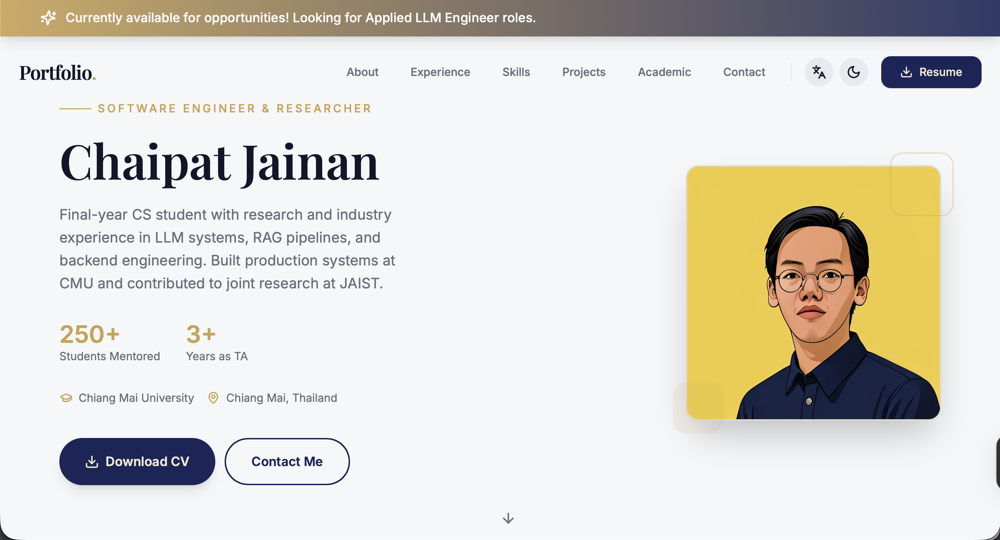
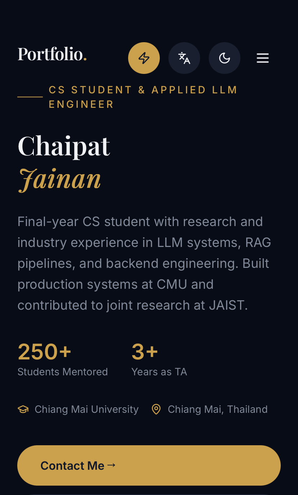

# Portfolio Website

A modern, responsive portfolio website built with React, featuring multilingual support, PWA capabilities, and optimized performance.

## Preview

<table>
  <tr>
    <td width="70%">
      
      <p align="center"><em>Desktop View</em></p>
    </td>
    <td width="30%">
      
      <p align="center"><em>Mobile View</em></p>
    </td>
  </tr>
</table>

## Tech Stack

- **Framework:** React 18 + Vite
- **Styling:** Tailwind CSS
- **UI Components:** shadcn/ui
- **Animations:** Framer Motion
- **Icons:** Lucide React
- **i18n:** react-i18next
- **Deployment:** Vercel

## Getting Started

### Prerequisites

- Node.js 18+ 
- npm or yarn

### Installation

```bash
# Clone the repository
git clone https://github.com/AppleBoiy/mysite.git

# Navigate to project directory
cd mysite

# Install dependencies
npm install

# Create .env file
cp .env.example .env

# Add your Web3Forms API key to .env
VITE_WEB3FORMS_ACCESS_KEY=your_api_key_here
```

### Development

```bash
# Start development server
npm run dev

# Build for production
npm run build

# Preview production build
npm run preview
```

## Project Structure

```
├── public/              # Static assets
├── src/
│   ├── components/      # React components
│   ├── contexts/        # React contexts
│   ├── hooks/          # Custom hooks
│   ├── locales/        # i18n translations
│   ├── pages/          # Page components
│   ├── utils/          # Utility functions
│   └── main.jsx        # App entry point
├── index.html
└── vite.config.js
```

## License

This project is licensed under the MIT License - see the [LICENSE](LICENSE) file for details.

## Contact

- Email: contact@chaipat.cc
- LinkedIn: [chaipat-jainan](https://www.linkedin.com/in/chaipat-jainan)
- GitHub: [@AppleBoiy](https://github.com/AppleBoiy)


